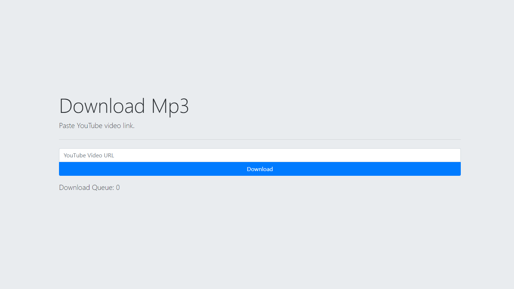
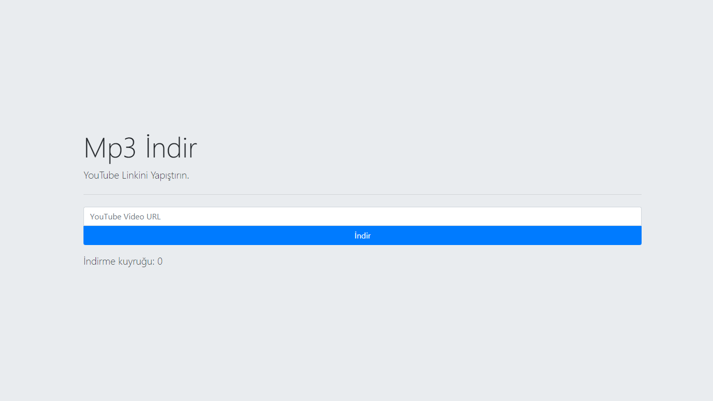

# youtube-dl API Server

This is a youtube-dl API server! You can make easily youtube-dl integrated apps with this server.

**Currently under development. The server ip and port can be changed in main.py. Will be improved with new updates.**

Mp3Bot YouTube-dl API Server now supporting download mp3 from easily!

* English
```
http://localhost:1998/en
```


* Turkish
```
http://localhost:1998/tr
```



### Requirements

* Python 3
* pip
* FFMPEG

Copy the ffmpeg.exe and ffprobe.exe files to the project directory. Only for Windows. For Linux, copy the following code and paste it into your terminal.
```
sudo apt-get install ffmpeg -y
```

* Install required packages with pip. Copy and paste following code into your console.

```
pip3 install -r requirements.txt
```

## Start Server

* Go to project root folder and open console. 
* Copy and paste following code into your console.
```
python main.py
```
* Go to http://localhost:1998

## Usage

###### Get Video Info
```
http://localhost:1998/api/info?video={video_url}
```

###### Download Video
```
http://localhost:1998/api/download?video={video_url}
```
It is downloaded to the root directory.

###### Get Download Queue
```
http://localhost:1998/api/queue
```

## License

This project is licensed under the MIT License - see the [LICENSE](LICENSE) file for details
